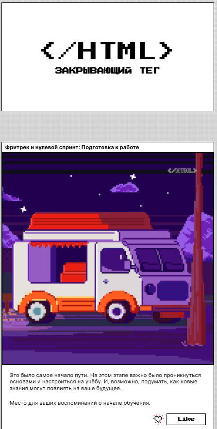

# Яндекс Практикум, проектная работа "Закрывающий тег"

## Оглавление 
- [Скриншот](#скриншот)
- [Ссылки](#ссылки)
- [Инструкция по запуску](#инструкция-по-запуску)

### Скриншот 


### Ссылки
- Репозиторий проекта: https://github.com/prositedeveloper zakrivayuschiy-teg-ad
- Проект опубликованный в GitHub-Pages: https://prositedeveloper.github.io zakrivayuschiy-teg-ad

### Инструкция по запуску
Чтобы запустить проект, нужно сделать несколько простых шагов:

Создайте папку и перейдите в неё:
```shell 
cd <name-folder>
```

Склонируйте этот репозиторий:
```shell 
git clone https://github.com/prositedeveloper/zakrivayuschiy-teg-ad.git
```

Откройте файл `index.html` в браузере для просмотра проекта.